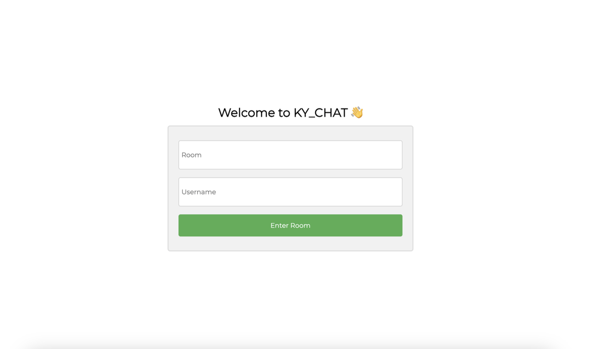
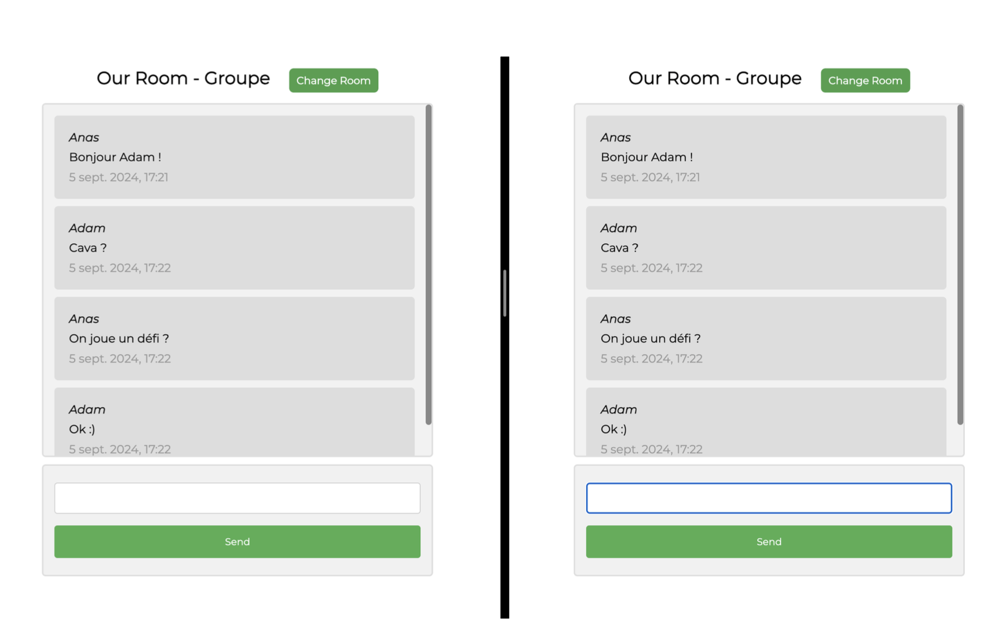

# KY-CHAT — Application web pour le chat en ligne (Django)


Application web de **messagerie en temps réel** développée avec **Django**.  
Elle permet aux utilisateurs de rejoindre des **salles de discussion (rooms)**, d’envoyer des messages, et de communiquer de façon simple & instantanée.


---

## 📌 Sommaire

1. [Fonctionnalités](#-fonctionnalités)
2. [Stack technique](#-stack-technique)
3. [Architecture & modèles](#-architecture-&-modèles)
4. [Démarrage rapide](#-démarrage-rapide)
    - [Prérequis](#-prérequis)
    - [Configuration locale](#2-installation-&-configuration-locale)
    - [Lancer l’app en local](#3-lancer-l’app-en-local)
5. [Aperçu](#-aperçu-screenshots)
6. [Auteurs](#-auteurs)
7. [Licence](#-licence)

---

## ✅ Fonctionnalités

💬 Création / accès à des salons de discussion (rooms)  
👤 Login utilisateur Django (auth standard)  
⚡ Messages affichés instantanément avec AJAX  
📄 Templates HTML / CSS / JavaScript natif  
🗄️ Base de données **SQLite** incluse  
🔐 Possibilité d’extension (auth sociale, WebSockets, etc.)  

---

## 🛠️ Stack technique

| Composant | Technologie |
|-----------|-------------|
| Backend | Django (Python 3.x) |
| Frontend | HTML5, CSS3, JavaScript, AJAX |
| Base de données | SQLite |
| Template Engine | Django Templates |
| Serveur local | `runserver` dev server |

---

## 🏗️ Architecture & modèles

```
src/
├─ manage.py
├─ db.sqlite3
├─ README.md
├─ djangoproject/ # Projet Django (settings / urls / wsgi)
│ ├─ settings.py
│ ├─ urls.py
│ └─ wsgi.py
└─ KY_CHAT/ # Application (chat rooms + messages)
├─ models.py
├─ views.py
├─ urls.py
├─ admin.py
├─ templates/
│ ├─ home.html
│ └─ room.html
└─ migrations/
```

### Modèle de données (simplifié)

| Modèle | Champs principaux |
|--------|-------------------|
| **Room** | id, name |
| **Message** | id, value, date, user, room |

---

## 🚀 Démarrage rapide

### 1️⃣ Prérequis

✅ Python **3.10+** <br/> 
✅ pip et virtualenv (optionnel) <br/>
✅ Git<br/>
✅ SQLite est inclus avec Python → rien à installer <br/>


### 2️⃣ Installation & configuration locale

```
# 1) Cloner le projet

git clone https://github.com/AnasKrir/KY-CHAT.git
cd KY-CHAT

# 2) Créer un environnement virtuel (recommandé)

python3 -m venv venv
source venv/bin/activate   # macOS/Linux
#.\venv\Scripts\activate   # Windows

# 3) Installer les dépendances

pip install -r requirements.txt  # si le fichier existe

# sinon :

pip install django

```

```
# Paramètres SQLite par défaut dans `settings.py` :

DATABASES = {
    'default': {
        'ENGINE': 'django.db.backends.sqlite3',
        'NAME': BASE_DIR / 'db.sqlite3',
    }
}

```

### 3️⃣ Lancer l’app en local

```

# Appliquer les migrations

python manage.py makemigrations
python manage.py migrate


# Lancer le serveur

python manage.py runserver

```


#### ➡️ App dispo sur : http://127.0.0.1:8000/


---

## 🎥 Aperçu (screenshots)

| Login | Room         | 
|-------|--------------|
|  |  |

---

## 👥 Auteurs

- **Anas KRIR** — Développeur Back-End / Gestion du projet
- **Adam EL YOURI** — Développeur Front-End / UI & intégration

---

 ## 📄 Licence

Projet sous licence MIT. <br/>
✅ Libre d’utiliser, modifier, distribuer.

© 2023 — KRIR Anas & EL YOURI Adam

---


